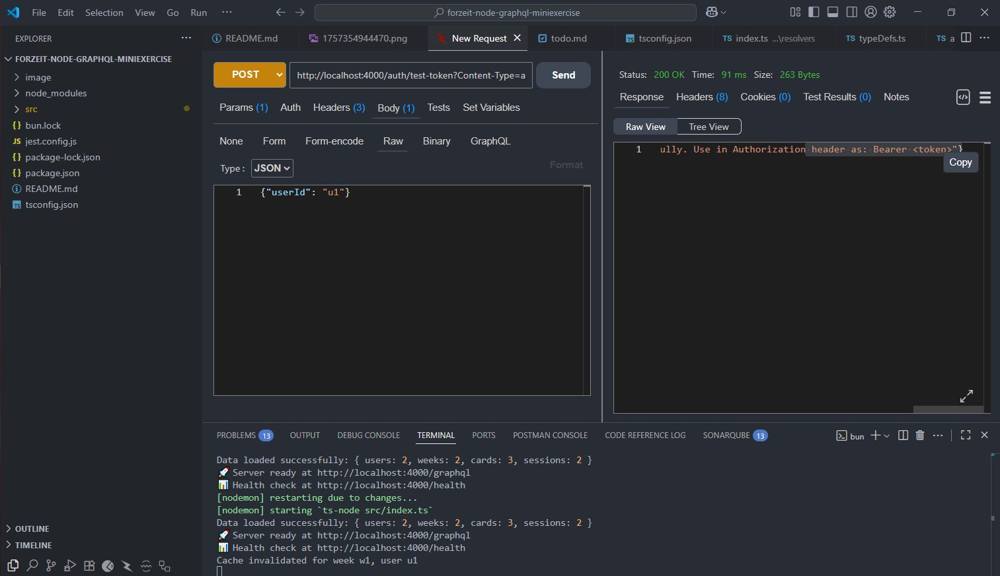
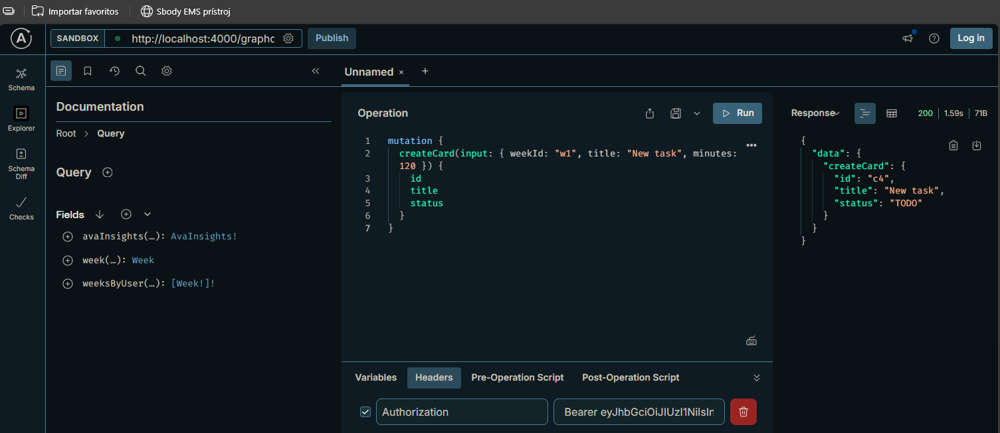

# Forzeit Stage 2 - GraphQL API

GraphQL API for the Forzeit project management system, using Node.js, TypeScript, Apollo Server, and following clean architecture principles.

## Features

- GraphQL API with Apollo Server v4
- JWT Authentication
- In-memory caching with TTL support (60s for insights)
- Input validation and error handling
- Domain-driven architecture with SoC
- TypeScript

## Requirements

- Node.js 18+
- npm |yarn|bun

## Installation

1. **Clone and install dependencies:**

```bash
cd forzeit-stage2
npm install
```

2. **Start development server:**

```bash
npm run dev
```

The server will start at `http://localhost:4000/graphql`

## Sample Usage

### 1. Access GraphQL Playground

Open your browser and navigate to `http://localhost:4000/graphql` in the Apollo Server GraphQL playground so you can GraphQL queries and mutations.

### 2. Generate Test Token

Authentication is required for all GraphQL operations. Generate a test token by making a POST request to `/auth/test-token`:

```bash
curl -X POST http://localhost:4000/auth/test-token \
  -H "Content-Type: application/json" \
  -d '{"userId": "u1"}'
```

Copy the returned JWT token then in Apollo click on "HTTP HEADERS" at the bottom and add:
It's the way I'm running in my machine:


```js
key:Authorization 
value:Bearer <your-token>
```

### 3. Query User's Weeks

Try:

```graphql
query {
  weeksByUser(userId: "u1", limit: 5) {
    id
    startISO
  }
}
```
Running in my machine:


### 4. Get Ava Insights (with caching)

Try:
```graphql
query {
  avaInsights(weekId: "w1") {
    totalMinutes
    doneCount
    focusScore
    recommendations
  }
}
```
Running in my machine:

### 5. Create a New Card
Try: 
```graphql
mutation {
  createCard(input: { weekId: "w1", title: "New task", minutes: 120 }) {
    id
    title
    status
  }
}
```
Running in my machine:

## Architecture

It is domain-driven architecture based.

```
src/
├── domains/           # Business logic by domain
│   ├── insights/      # Ava AI insights
│   ├── user/          # User management
│   ├── week/          # Week management
│   └── card/          # Card management
├── shared/            # Shared utilities
│   ├── auth/          # JWT authentication
│   ├── cache/         # In-memory caching
│   ├── data/          # Data access layer
│   └── types/         # TypeScript types
├── graphql/           # GraphQL layer
│   ├── schemas/       # Type definitions
│   └── resolvers/     # Query/Mutation resolvers
└── data/              # Seed data
```

## Calculations

- **Total Minutes**: Sum of all card minutes in the week
- **Done Count**: Number of cards with DONE status
- **Focus Score**: `min(100, round((doneCount * 10) + (totalSessionMinutes/60 * 5)))`

## Caching Strategy

- **Target**: `avaInsights` query only
- **TTL**: 60 seconds
- **Headers**: `X-Cache: HIT|MISS`
- **Invalidation**: Automatic on card create/update
- **Storage**: In-memory -not persistent-

## Security

- **JWT Authentication**: Required for all operations
- **User Isolation**: Users can only access their own data
- **Input Validation**: Comprehensive validation on all mutations
- **Error Handling**: Detailed error messages without exposing internals

## Monitoring Endpoints

- **Health Check**: `GET /health`
- **Cache Stats**: `GET /cache/stats`
- **Test Token**: `POST /auth/test-token`

## Trade-offs

### Current Implementation

- **In-memory data storage** - Simple but not persistent
- **Single-node caching** - Fast but doesn't scale horizontally
- **JWT secret in code** - Just for development
- **No rate limiting** - Unlimited requests allowed
- **Basic error logging** - Console logs only

### My Recommendations

1. From in-memory storage with PostgreSQL/MongoDB
2. Distributed cache for multi-node deployments
3. Externalize all configuration in env variables
4. Implement per-user request limits
5. Use Winston/Pino with log aggregation as logging strategy
6. I would  add database connectivity checks
7. Also for monitoring I would use Prometheus/other
8. No input was sanitized, I would add in production XSS/injection protection

### Performance you can expect

- **Query Response**: ~5-50ms (depending on complexity)
- **Cache Hit**: ~1-2ms response time
- **Memory Usage**: ~50MB base + cache data
- **Concurrent Users**: Not tested

## Known Issues

- Cache headers not fully implemented for all GraphQL responses
- Session duration calculation doesn't handle timezone cases
- GraphQL subscription support not implemented

## License

MIT License - feel free to use this code as a reference as my dev skills.

---

Built by Jesus with ❤️ following clean architecture principles.
